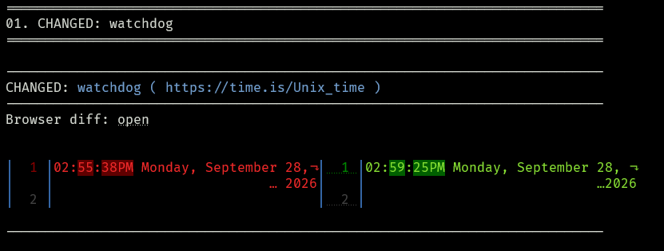
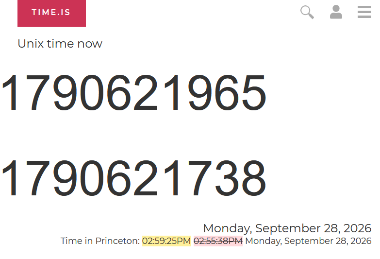

# UrlWatchVisualDiff
A urlwatch filter to create .html files with visual diffs.

To use this, perform the following:
- Copy `hooks.py` to the directory where the `urls.yaml` file is stored (e.g., `$XDG_CONFIG_HOME/urlwatch/`)
- Add `  - browserdiff` as the first filter to a job of your choice in you `urls.yaml`:
    ```yaml
    name: watchdog
    kind: url
    url: https://time.is/Unix_time
    filter:
    - browserdiff
    - element-by-id: smalltime
    - html2text
    - re.sub:
            pattern: '(.*)'
            repl: '\1\n'
    ```
- Run `urlwatch` once to create a baseline
- After capturing at least 1 change in the job relative to the baseline, an .html file with visual diffs will be save in `$XDG_CONFIG_HOME/urlwatch/BrowserDiff/JobName`
- In urlwatch's standard output, the first line includes a clickable `open` link to open the visual diff:
    <center>

    

    </center>
- The visual diff highlights changes:
    <center>

    

    </center>